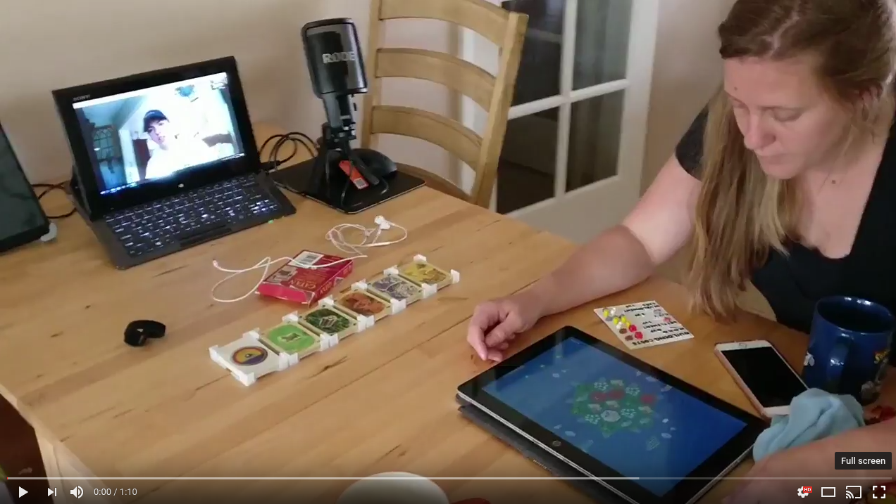

# Ka-Tan


Ka-tan is a board sharing program to play CatanⓇ with people over long distances. Unlike the many CatanⓇ apps, this was designed to emulate the physical nature of playing the actual board game as much as possible. No fancy trading dialog. This is more like if you had a camera pointed at your board and a robot moving the pieces on the other end. Same on your end for the other players.


## Short Demo Video
[](https://youtu.be/5hT4CSYWcNQ)

## How to play

#### Client
For the client [simply click here](http://katan.starlg.com)
or
- Download the latest [release](https://github.com/FoxUSA/Ka-tan/releases)
- Throw the zip contents onto a web server, s3, or

#### Server
- Launch the [server](https://github.com/FoxUSA/Ka-tan-Server) somewhere, forward ports if your behind a NAT(tldr Basically a router).
```
If you want to try it out real quick, launch the server and put in http://127.0.0.1:3000 in the client
```
- Send everyone the link. Enjoy!


## Controls
Touch interface. You can drag pieces,and the robber around. To rotate roads, simply double tap them. You can roll the dice by tapping the roll in the top left.

## Recommended playing configuration
### Each player
- 1 Device to do video calling over
- 1 Device to run the board
- [1 Deck of CatanⓇ cards](https://www.amazon.com/gp/product/B014GFWBOM/ref=as_li_tl?ie=UTF8&camp=1789&creative=9325&creativeASIN=B014GFWBOM&linkCode=as2&tag=f05503-20&linkId=178d7645502d916e3481f89bf87b3ec9) `affiliate link`

See video above.

### Shared
A machine that runs [NodeJS](https://nodejs.org/en/)

## Support us

- [Give us a heart on Alternative To](http://alternativeto.net/software/ka-tan/)
- Make sure to star this project
- Follow me on [GitHub](https://github.com/FoxUSA), [Twitter](https://twitter.com/FoxUSA)

## FAQ

### I need a chat. Why don't you build one?
Facetime, Hangouts, Skype, Duo, ....

### Why did you not implement cards

`Cards are normally secret. It was hard to come up with a way to work that into a screen everyone looks at. MVP didn't need it. Multiple banks works well. This is open source so implement it yourself if it bugs you.`

### Is this against copyright law because of bla bla bla

`¯\_(ツ)_/¯ who knows. `
[Colonizers](https://github.com/colonizers/colonizers) another opensouce project has existed for awhile and hasn't been hunted down and had all their resource cards taken away.

## Credits
Thank you to http://kenney.nl/ for graphics

## License
- Liscom flag is copyright of Liscom family 2016
- Other art is [CC0 1.0 Universal](https://creativecommons.org/publicdomain/zero/1.0/)
- Code is provided under a MIT license
