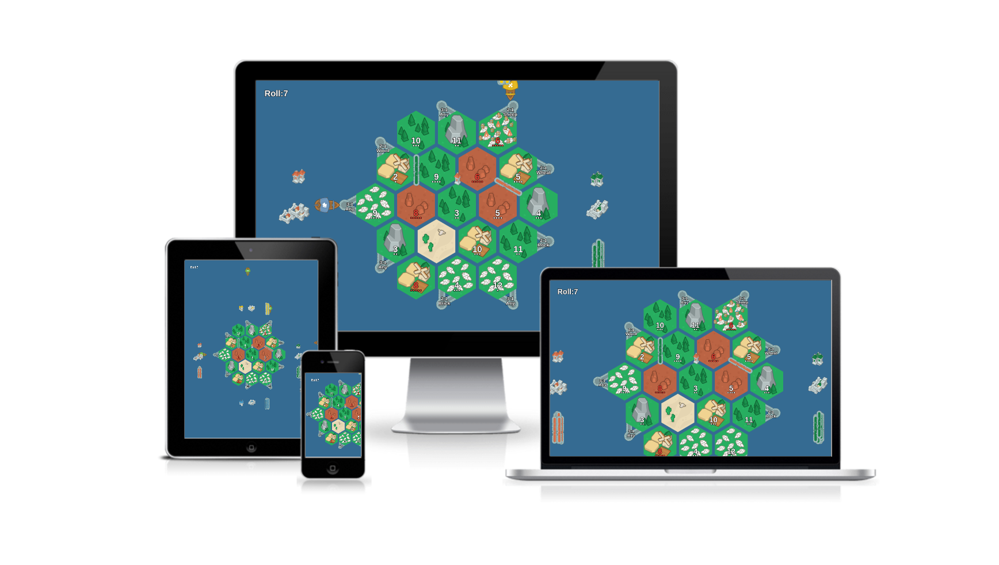
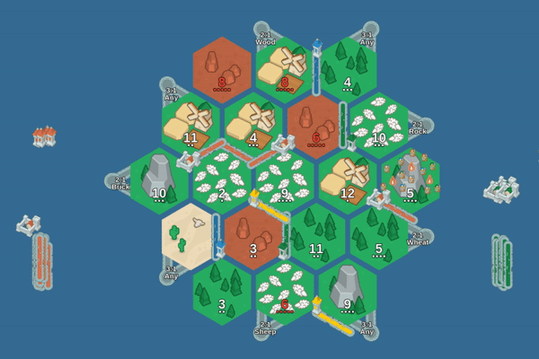

# Ka-Tan



Ka-tan is a board sharing program to play CatanⓇ with people over long distances.

//TODO youtube video

## How to play
- Do a `bower install`
- Throw the
```
index.html
app/
bower_components/
```
onto a web server, s3, or simply go here//TODO upload to github pages
Launch the [server](https://github.com/FoxUSA/Ka-tan-Server) somewhere, forward ports if your behind a NAT(tldr Basically a router).
- Send everyone the link. Enjoy!




## Recommended playing configuration
### Each player
- 1 Device to do video calling over
- 1 Device to run the board
- [1 Deck of CatanⓇ cards](https://www.amazon.com/gp/product/B014GFWBOM/ref=as_li_tl?ie=UTF8&camp=1789&creative=9325&creativeASIN=B014GFWBOM&linkCode=as2&tag=f05503-20&linkId=178d7645502d916e3481f89bf87b3ec9) `affiliate link`

//TODO photo

### Shared
A server that runs Node

## Support us

[Give us a heart on Alternative To}(http://alternativeto.net/software/ka-tan/)

## FAQ

### I need a chat. Why don't you build one?
Facetime, Hangouts, Skype, Duo, Allo ....

### Why did you not implement cards

`Cards are normally secret. It was hard to come up with a way to work that into a screen everyone looks at. MVP didn't need it. Multiple banks works well. This is open source so implement it yourself if it bugs you.`

### Is this against copyright law because of bla bla bla

`¯\_(ツ)_/¯ who knows. `
[Colonizers](https://github.com/colonizers/colonizers) another opensouce project has existed for awhile and hasn't been hunted down and had all their resource cards taken away.

## Credits
Thank you to http://kenney.nl/ for graphics

## License
- Liscom flag is copyright of Liscom family 2016
- Other art is public domain
- Code is provided under a MIT license
